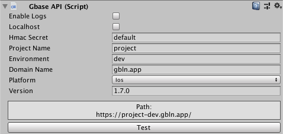

#Setup guide

1. Import package into your project
2. Add `GbaseAPI.cs` script to any gameobject in you scene. `GbaseAPI.cs` puts its gameobject to *DonDestroyOnLoad* part, so make sure, you wont Destroy this gameobject at runtime.
3. Set required fields:  
	* **Hmac Secret** - server side security key
	* **Project Name**, **Environment** and **Domain Name** - base path of the requests 
	* **Platform** - specify build platform
	* **Version** - minimal server version

	

4. Press "Test" button. If you correctly setup **Project Name**, **Environment** and **Domain Name**, then you will get success dialog window;

##Next step

[Authentication page](/auth)  
 
See also [examples page](/examples)